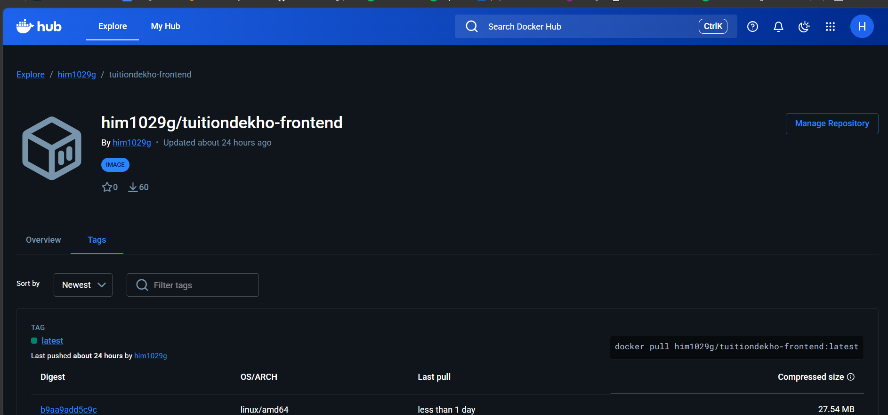
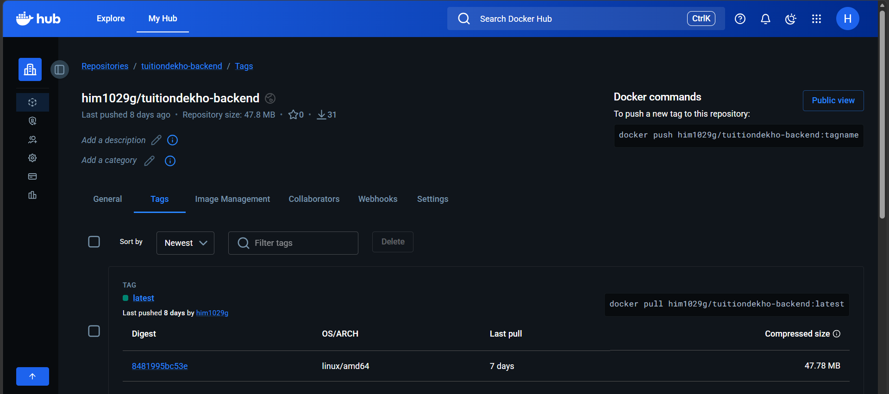
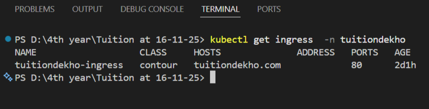
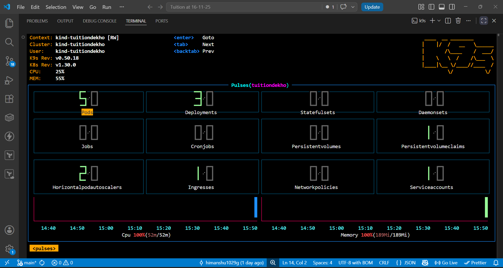
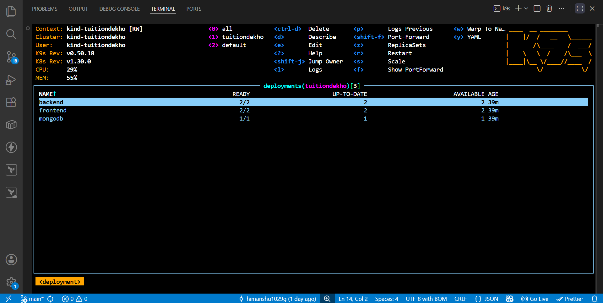
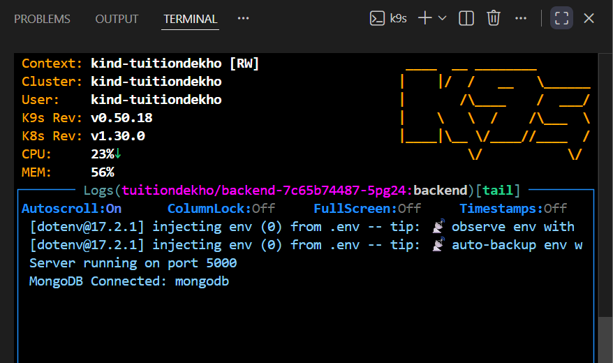
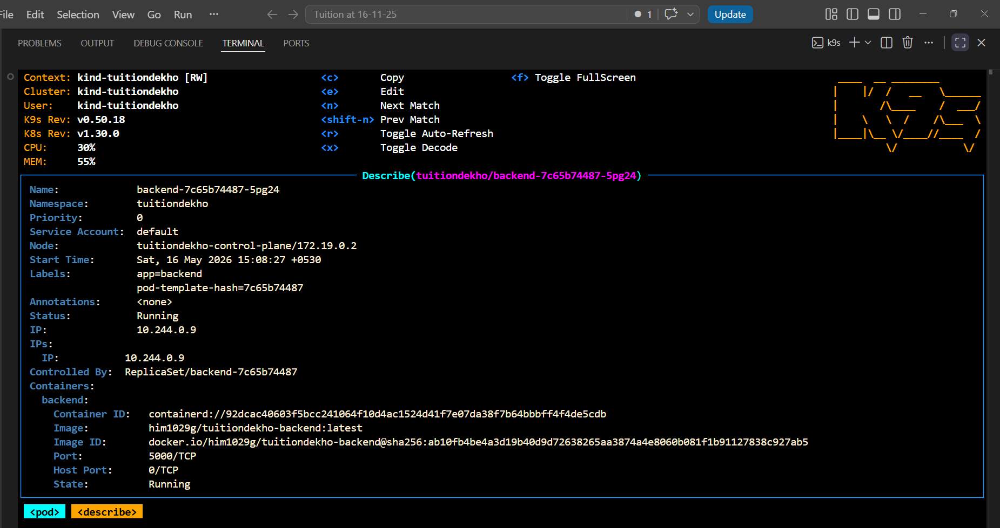

# TuitionDekho-K8s 🎓

### Cloud-Native 3-Tier Tuition Marketplace on Kubernetes

<div align="center">

[](https://www.docker.com/)
[](https://kubernetes.io/)
[](https://kind.sigs.k8s.io/)
[](https://kubernetes.io/docs/tasks/run-application/horizontal-pod-autoscale/)
[](https://hub.docker.com/u/him1029g)
[](https://www.mongodb.com/)
[](https://reactjs.org/)
[](https://nodejs.org/)
[](https://www.mongodb.com/)


> A production-grade, cloud-native tuition marketplace — built with MERN stack, containerized with Docker, orchestrated with Kubernetes, and auto-scaled with HPA.

</div>

---

## 🌐 Live Links

| Service | URL |
|---------|-----|
| Frontend (Vercel) | [https://tuition-dekho.vercel.app/](https://tuition-dekho.vercel.app/) |
| Backend (Render) | [https://tuitiondekho.onrender.com](https://tuitiondekho.onrender.com) |
| DockerHub Frontend | [him1029g/tuitiondekho-frontend](https://hub.docker.com/r/him1029g/tuitiondekho-frontend) |
| DockerHub Backend | [him1029g/tuitiondekho-backend](https://hub.docker.com/r/him1029g/tuitiondekho-backend) |

---

## 📌 What is TuitionDekho-K8s?

**TuitionDekho-K8s** is an online tuition marketplace that bridges the gap between students seeking quality education and qualified teachers offering their expertise.

This project goes beyond a standard MERN app — it is a **fully cloud-native implementation** featuring:

- ✅ Multi-stage Docker builds for optimized images
- ✅ Kubernetes orchestration with Kind (local cluster)
- ✅ Contour Ingress for routing via custom domain `tuitiondekho.com`
- ✅ Horizontal Pod Autoscaler (HPA) for auto-scaling
- ✅ Persistent storage for MongoDB via PVC
- ✅ Kubernetes Secrets for sensitive data
- ✅ Images published to DockerHub

---

## 🏗️ System Design — 3-Tier Cloud Native Architecture

```
                         ┌──────────────────────────────────┐
                         │         User (Browser)            │
                         └───────────────┬──────────────────┘
                                         │ http://tuitiondekho.com:8080
                                         ▼
                    ┌────────────────────────────────────────┐
                    │       Contour Ingress Controller        │
                    │   (Envoy Proxy — Routes HTTP traffic)   │
                    └──────────┬─────────────────┬───────────┘
                               │                 │
               /api, /socket.io│                 │ /
                               ▼                 ▼
          ┌────────────────────────┐  ┌───────────────────────┐
          │   TIER 2 — Backend     │  │  TIER 1 — Frontend    │
          │   Node.js + Express    │  │  React 18 + Vite      │
          │   Socket.IO            │  │  Nginx (port: 8080)   │
          │   Port: 5000           │  │  Port: 8080           │
          │   Replicas: 2→5 (HPA) │  │  Replicas: 2→4 (HPA) │
          └──────────┬─────────────┘  └───────────────────────┘
                     │ Mongoose ODM
                     ▼
          ┌────────────────────────┐
          │   TIER 3 — Database    │
          │   MongoDB 7 (Official) │
          │   Port: 27017          │
          │   PVC: 1Gi Persistent  │
          └────────────────────────┘

  ┌──────────────────────────────────────────────────────────────────┐
  │                  Kubernetes Cluster (Kind)                        │
  │  Namespace: tuitiondekho                                          │
  │                                                                    │
  │  ┌──────────────┐  ┌──────────────┐  ┌──────────┐  ┌─────────┐  │
  │  │     Pods     │  │   Services   │  │ Ingress  │  │   HPA   │  │
  │  │  frontend x2 │  │  frontend    │  │ Contour  │  │backend  │  │
  │  │  backend  x2 │  │  backend     │  │ (Envoy)  │  │2 → 5   │  │
  │  │  mongodb  x1 │  │  mongodb     │  │          │  │frontend │  │
  │  └──────────────┘  └──────────────┘  └──────────┘  │2 → 4   │  │
  │                                                      └─────────┘  │
  └──────────────────────────────────────────────────────────────────┘
```

| Tier | Technology | Docker Image | Replicas |
|------|-----------|--------------|----------|
| **Frontend** | React 18 + TypeScript + Vite + Nginx | `him1029g/tuitiondekho-frontend:latest` | 2 (HPA max: 4) |
| **Backend** | Node.js 18 + Express.js + Socket.IO | `him1029g/tuitiondekho-backend:latest` | 2 (HPA max: 5) |
| **Database** | MongoDB 7 (Official DockerHub Image) | `mongo:7` | 1 + PVC |

---

## 🚀 Key Features

| Feature | Description |
|---------|-------------|
| **Real-time Chat** | Instant messaging with Socket.IO |
| **Video Calls** | Peer-to-peer calling via Jitsi Meet |
| **Meeting Scheduler** | Request, accept/reject meetings |
| **Notifications** | Real-time alerts and email notifications |
| **Secure Auth** | JWT-based authentication with bcrypt |
| **Teacher Discovery** | Search by subject, class, location |
| **Password Reset** | Email-based password reset flow |
| **HPA Autoscaling** | Auto scale pods based on CPU/memory load |

---

## 🛠️ Tech Stack

### Frontend
- **Framework:** React 18 (TypeScript)
- **Build Tool:** Vite
- **Styling:** Tailwind CSS + Shadcn/ui
- **State Management:** React Context + TanStack Query
- **Real-time:** Socket.IO Client
- **Server:** Nginx Alpine (port 8080, non-root user)

### Backend
- **Runtime:** Node.js 18
- **Framework:** Express.js
- **Database:** MongoDB with Mongoose ODM
- **Auth:** JWT + bcryptjs
- **Real-time:** Socket.IO
- **Email:** Nodemailer (Gmail SMTP)

### DevOps & Infrastructure
- **Containers:** Docker (multi-stage builds, Alpine images)
- **Compose:** Docker Compose (local development)
- **Orchestration:** Kubernetes via Kind (local cluster)
- **Ingress:** Contour (Envoy-based ingress controller)
- **Autoscaling:** HPA — Horizontal Pod Autoscaler
- **Metrics:** metrics-server (for HPA)
- **Storage:** PersistentVolumeClaim for MongoDB
- **Secrets:** Kubernetes Secrets for credentials
- **Registry:** DockerHub (`him1029g`)

---

## 📦 Project Structure

```
TuitionDekho-K8s/
├── frontend/
│   ├── src/
│   │   ├── components/        # Reusable React components
│   │   ├── pages/             # Page components
│   │   ├── hooks/             # Custom React hooks
│   │   ├── lib/               # API calls and utilities
│   │   └── contexts/          # React Context providers
│   ├── Dockerfile             # Multi-stage: Node build → Nginx serve
│   ├── nginx.conf             # Nginx config with /api proxy to backend
│   ├── .dockerignore
│   └── package.json
│
├── backend/
│   ├── controllers/           # Route handlers
│   ├── models/                # MongoDB schemas (Mongoose)
│   ├── routes/                # API endpoints
│   ├── middleware/             # Auth + validation middleware
│   ├── services/              # Business logic (email, etc.)
│   ├── config/                # Database configuration
│   ├── socket.js              # Socket.IO setup
│   ├── server.js              # Main entry point
│   ├── Dockerfile             # Production Node.js Alpine image
│   ├── .dockerignore
│   └── package.json
│
├── k8s/                       # Kubernetes manifests
│   ├── namespace.yml          # tuitiondekho namespace
│   ├── mongo-deployment.yml   # MongoDB + PVC + ClusterIP Service
│   ├── backend-deployment.yml # Backend Deployment + Secret + Service
│   ├── frontend-deployment.yml # Frontend Deployment + Service
│   ├── ingress.yml            # Contour Ingress (tuitiondekho.com)
│   └── hpa.yml                # HPA for frontend + backend
│
├── screenshots/               # Project screenshots
├── docker-compose.yml         # Docker Compose for local dev
├── kind-config.yml            # Kind cluster configuration
└── README.md
```

---

## 🐳 Docker Setup

### Build & Push Images to DockerHub

```bash
# Login to DockerHub with token
docker login -u him1029g

# Build + Push Frontend
cd frontend
docker build -t him1029g/tuitiondekho-frontend:latest .
docker push him1029g/tuitiondekho-frontend:latest

# Build + Push Backend
cd ../backend
docker build -t him1029g/tuitiondekho-backend:latest .
docker push him1029g/tuitiondekho-backend:latest
```

### DockerHub Images




---

## ☸️ Kubernetes Setup — Step by Step (Kind Local Cluster)

### Prerequisites

| Tool | Install Command |
|------|----------------|
| Docker Desktop | [docker.com/products/docker-desktop](https://www.docker.com/products/docker-desktop/) |
| kubectl | `winget install -e --id Kubernetes.kubectl` |
| Kind | `winget install -e --id Kubernetes.kind` |

```bash
# Verify installations
kubectl version --client
kind version
docker --version
```

---

### Step 1 — Create Kind Cluster

```bash
kind create cluster --config kind-config.yml
kubectl cluster-info --context kind-tuitiondekho
kubectl get nodes
```

Expected:
```
NAME                         STATUS   ROLES           AGE
tuitiondekho-control-plane   Ready    control-plane   1m
```

---

### Step 2 — Install Contour Ingress Controller

```bash
kubectl apply -f https://projectcontour.io/quickstart/contour.yaml
kubectl get pods -n projectcontour -w
```

Expected:
```
contour-xxx   1/1   Running   0   2m
envoy-xxx     2/2   Running   0   2m
```

---

### Step 3 — Apply All Kubernetes Manifests

```bash
kubectl apply -f k8s/
```


---

### Step 4 — Verify Pods Running

```bash
kubectl get pods -n tuitiondekho -w
```


---

### Step 5 — Install Metrics Server (Required for HPA)

```powershell
kubectl apply -f https://github.com/kubernetes-sigs/metrics-server/releases/latest/download/components.yaml

# Patch for Kind cluster
@"
[{"op":"replace","path":"/spec/template/spec/containers/0/args","value":["--cert-dir=/tmp","--secure-port=10250","--kubelet-preferred-address-types=InternalIP,ExternalIP,Hostname","--kubelet-use-node-status-port","--metric-resolution=15s","--kubelet-insecure-tls"]}]
"@ | Out-File -FilePath patch.json -Encoding utf8

kubectl patch deployment metrics-server -n kube-system --type=json --patch-file=patch.json
```

---

### Step 6 — Verify Services and Ingress

```bash
kubectl get svc -n tuitiondekho
kubectl get ingress -n tuitiondekho
```




---

### Step 7 — Add Local Domain to Hosts File

```powershell
# Windows PowerShell (Admin)
Add-Content -Path "C:\Windows\System32\drivers\etc\hosts" -Value "127.0.0.1  tuitiondekho.com"
```

---

### Step 8 — Port Forward and Access

```powershell
kubectl port-forward -n projectcontour svc/envoy 8080:80
```

Open browser: **http://tuitiondekho.com:8080**


---

## 📈 Horizontal Pod Autoscaler (HPA)

HPA is a Kubernetes feature that **automatically scales pods up or down** based on real-time CPU and memory metrics — ensuring the app handles traffic spikes without any manual intervention.

### How HPA Works in TuitionDekho-K8s

```
                    ┌─────────────────┐
                    │  metrics-server  │  ← collects CPU/memory every 15s
                    └────────┬────────┘
                             │
                             ▼
                    ┌─────────────────┐
                    │  HPA Controller  │  ← compares usage vs target
                    └────────┬────────┘
                             │
               ┌─────────────┴──────────────┐
               │                            │
               ▼                            ▼
    CPU > 70% detected              CPU < 70% (normal)
    Scale UP → add pods             Scale DOWN → remove pods
```

1. `metrics-server` collects CPU/memory data from every pod every 15 seconds
2. HPA controller compares **current usage** vs **target threshold**
3. If usage exceeds threshold → new pods are automatically created
4. When traffic normalizes → extra pods are automatically terminated

### HPA Configuration

| Deployment | Min Replicas | Max Replicas | CPU Trigger | Memory Trigger |
|------------|-------------|-------------|-------------|----------------|
| **backend** | 2 | 5 | > 70% avg | > 80% avg |
| **frontend** | 2 | 4 | > 70% avg | — |

### Real-World Scaling Scenario

```
Normal traffic   → backend: 2 pods (CPU: 4%)
Traffic spike    → HPA detects CPU > 70%
Auto scale up    → 2 → 3 → 4 → 5 pods created automatically
Traffic drops    → HPA detects CPU back to normal
Auto scale down  → 5 → 3 → 2 pods terminated automatically
```

### HPA Commands

```bash
# Check HPA status
kubectl get hpa -n tuitiondekho

# Watch autoscaling live
kubectl get hpa -n tuitiondekho -w

# Detailed HPA info
kubectl describe hpa backend-hpa -n tuitiondekho
```


---

## 🖥️ k9s — Kubernetes Terminal UI

**k9s** is a terminal-based Kubernetes dashboard that lets you visualize and interact with your cluster in real-time — no browser, no Grafana needed.

### Install k9s

```bash
winget install -e --id derailed.k9s
```

### Run k9s

```bash
k9s --namespace tuitiondekho
```

### k9s Screenshots

#### All Resources Overview


#### Deployments View


#### Pods View


#### Pod Logs (Live)


#### Namespace View


#### Pod Description


### k9s Keyboard Shortcuts

| Key | Action |
|-----|--------|
| `:pod` | View all pods |
| `:deploy` | View deployments |
| `:svc` | View services |
| `:hpa` | View HPA |
| `l` | View logs |
| `d` | Describe resource |
| `ctrl+c` | Exit |

---

## 🖼️ Application Screenshots

### Home Page


### Student Dashboard


### Teacher Dashboard


### Kubernetes — All Resources


### Terminal — Cluster Running


---

## 🔧 Useful kubectl Commands

```bash
# View all resources
kubectl get all -n tuitiondekho

# Pod logs
kubectl logs -f deployment/backend -n tuitiondekho
kubectl logs -f deployment/frontend -n tuitiondekho

# Exec into pod
kubectl exec -it <pod-name> -n tuitiondekho -- sh

# Manual scale
kubectl scale deployment backend --replicas=3 -n tuitiondekho

# Restart after new image push
kubectl rollout restart deployment/frontend -n tuitiondekho
kubectl rollout restart deployment/backend -n tuitiondekho

# Delete all resources
kubectl delete namespace tuitiondekho

# Delete Kind cluster
kind delete cluster --name tuitiondekho
```

---

## 🔄 Re-deploy from Scratch

```bash
# 1. Create cluster
kind create cluster --config kind-config.yml

# 2. Install Contour ingress
kubectl apply -f https://projectcontour.io/quickstart/contour.yaml
kubectl get pods -n projectcontour -w

# 3. Apply all manifests
kubectl apply -f k8s/
kubectl get pods -n tuitiondekho -w

# 4. Install + patch metrics-server (run Step 5 above)

# 5. Add hosts entry (PowerShell Admin)
Add-Content -Path "C:\Windows\System32\drivers\etc\hosts" -Value "127.0.0.1  tuitiondekho.com"

# 6. Port forward
kubectl port-forward -n projectcontour svc/envoy 8080:80

# 7. Open http://tuitiondekho.com:8080
```

---

## 🔐 Security Features

- JWT token-based authentication with expiry
- Password hashing with bcrypt (10 salt rounds)
- Email-based password reset with expiring tokens
- Protected API routes via auth middleware
- CORS configuration for allowed origins
- Non-root user in all Docker containers
- Kubernetes Secrets for MONGO_URI and JWT_SECRET
- `.dockerignore` excludes `.env` and `node_modules`

---

## 📊 Future Enhancements

- CI/CD pipeline with GitHub Actions
- Helm charts for Kubernetes deployment
- Monitoring with Prometheus + Grafana
- Payment integration (Razorpay)
- Mobile app (React Native)

---

## 👤 Author

**Himanshu Gupta**
- GitHub: [@himanshu1029g](https://github.com/himanshu1029g)
- DockerHub: [him1029g](https://hub.docker.com/u/him1029g)
- Email: ft.himanshu10@gmail.com

---

## 📄 License

MIT License

---

<div align="center">

Made with ❤️ for students and teachers everywhere.

**Last Updated:** May 2026

</div>